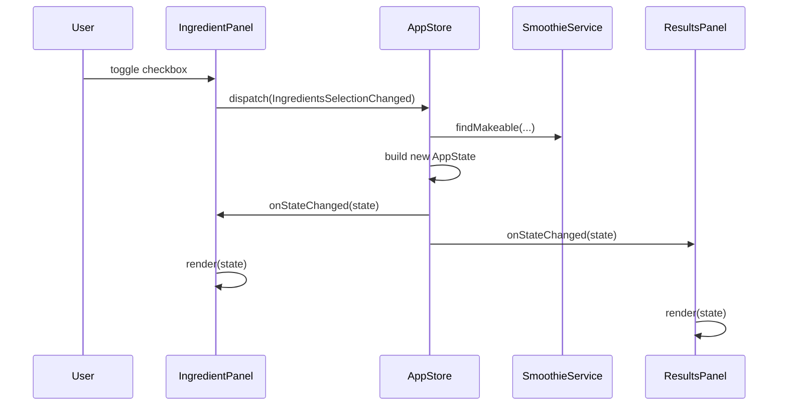

<!-- omit in toc -->
# Smoothie Maker

A desktop **Swing** application backed by **Spring Boot**. Users select ingredients they have; the app shows which smoothie recipes from a YAML catalog can be made.

This project uses a small **unidirectional, state-driven UI** pattern: UI components send **messages**, a central **store** holds **application state**, and views **render from that state** on the Swing Event Dispatch Thread (EDT).

<!-- omit in toc -->
## Table of Contents

- [Requirements](#requirements)
- [Quick start](#quick-start)
- [Architecture overview](#architecture-overview)
- [Stateful UI: `AppState`, messages, and `AppStore`](#stateful-ui-appstate-messages-and-appstore)
  - [Application state](#application-state)
  - [Messages (actions)](#messages-actions)
  - [`AppStore`](#appstore)
- [Domain layer (Spring services)](#domain-layer-spring-services)
- [Project layout](#project-layout)
- [Configuration](#configuration)
- [Why Spring Boot for a Swing app?](#why-spring-boot-for-a-swing-app)
- [Testing](#testing)
- [Design notes and tradeoffs](#design-notes-and-tradeoffs)
  - [Strengths](#strengths)
  - [Tradeoffs](#tradeoffs)
  - [Possible extensions](#possible-extensions)

## Requirements

- Java 21+
- Maven 3.9+
- [ImageMagick](https://imagemagick.org/) (`magick`) — only if you regenerate icons

## Quick start

```bash
make help    # list targets
make dev     # Spring Boot (development; compiles first)
make prod    # fat JAR (production-like)
make test    # unit tests
make verify  # tests + package
make lint    # Spotless check + compile
make format  # apply Spotless
make hooks   # install git pre-commit (Spotless + compile)
```

**App icon:** Window and dock icons load from `src/main/resources/icons/`. Source artwork lives in `assets/logo.png`. After changing the logo, run `make icons` (see [assets/README.md](assets/README.md)).

Override the recipe file:

```bash
make dev -- --smoothies.data-file=data/smoothies.yml
```

User data lives in a per-OS config directory (`smoothie-maker` under Application Support, `%APPDATA%`, or `~/.config`). It holds `preferences.json` (theme, UI scale, window bounds, saved ingredient selection) and `logs/` (daily rolling `smoothie-maker.log` + `smoothie-maker-YYYY-MM-DD.log`, 30 days retained). See [Configuration](#configuration).

## Architecture overview

Spring Boot provides **dependency injection** and **configuration**. Swing provides the **desktop UI**. The two are connected deliberately:

| Layer | Responsibility |
| ----- | -------------- |
| **Bootstrap** (`SmoothieApp`) | Configures log dir, loads bootstrap preferences, applies FlatLaf, starts Spring with `headless(false)`, shows `SmoothieFrame` on the EDT |
| **Domain** (`service`, `repository`, `model`) | Business rules and recipe data (no Swing types) |
| **UI** (`ui.*`) | State, messages, panels, frame layout |
| **Infrastructure** (`io`, `config`) | YAML/JSON I/O, app directories, preferences, Jackson beans |

```text
┌─────────────────────────────────────────────────────────────┐
│  SmoothieApp (@SpringBootApplication)                       │
│    main() → Spring context → SmoothieFrame on EDT           │
└────────────────────────────┬────────────────────────────────┘
                             │
         ┌───────────────────┼────────────────-───┐
         ▼                   ▼                    ▼
   IngredientPanel      ResultsPanel         ActionsPanel
     (user input)        (read-only)         (log report)
         │                   ▲                    │
         │  dispatch()       │ subscribe()        │ dispatch()
         └──────────────► AppStore ◄──────────────┘
                            │
                            ▼
                    SmoothieService
                    SmoothieRepository
                            │
                            ▼
                    data/smoothies.yml
```

Swing itself is **imperative** (`setText`, `setSelected`, etc.). This app keeps that at the edges and treats the **screen as a function of state** in the middle.

## Stateful UI: `AppState`, messages, and `AppStore`

### Application state

`AppState` is an immutable snapshot of everything the UI needs to display:

- Loaded recipes and ingredient catalog
- Currently selected ingredients
- Formatted result lines for the smoothie list
- Count and “Selected: …” summary text

When state changes, the store notifies subscribers; each panel updates its widgets in `render(AppState)`.

### Messages (actions)

User interactions do **not** call other panels directly. They send **`AppMessage`** instances to `AppStore.dispatch()`:

| Message | Effect |
| ------- | ------ |
| `IngredientsSelectionChanged` | Recompute makeable smoothies from checkbox selection |
| `SelectAllIngredients` | Select every ingredient |
| `ClearAllIngredients` | Clear selection |
| `LogReportRequested` | Write a detailed report to the log (no state change) |

This is a lightweight **Flux-style** flow: **event → new state → re-render**.



### `AppStore`

- **Single source of truth** for UI state
- **`dispatch(AppMessage)`** — applies business logic via `SmoothieService`, builds the next `AppState`
- **`subscribe(StateListener)`** — panels register once; notifications run on the **EDT** (`SwingUtilities.invokeLater` when needed)
- **Testable without Swing** — see `AppStoreTest`

Panels stay dumb where possible:

- **`IngredientPanel`** — publishes selection messages; `render()` syncs checkboxes and the selected summary
- **`ResultsPanel`** — only `render(state)` (passive view)
- **`ActionsPanel`** — dispatches `LogReportRequested`
- **`SmoothieFrame`** — layout, window bounds, session restore, shutdown
- **`FrameChrome`** — icons, menu bar, title (`AppMenuBar` via fluent `MenuBarBuilder`)
- **`AppMenuBar`** — File (import/export selection, preferences, exit) and Help (about)

## Domain layer (Spring services)

| Component | Role |
| --------- | ---- |
| `SmoothieRepository` | Loads recipes from YAML at startup |
| `SmoothieService` | `canMake`, `findMakeable`, formatting helpers |
| `YamlLoader` | Spring bean; Jackson YAML → Java records |
| `IngredientSelectionJson` | Import/export of selected ingredients as JSON |
| `SmoothieProperties` | `smoothies.data-file` from `application.yml` |
| `AppPreferencesStore` | Persists theme, scale, bounds, and selection to `preferences.json` |

Models are **Java records** (`Smoothie`, `Ingredients`, `SmoothiesWrapper`).

## Project layout

```text
src/main/java/org/example/smoothies/
├── SmoothieApp.java
├── config/
│   ├── AppConfig.java            # preferences.json path bean
│   ├── AppDirectories.java       # config + logs directories
│   ├── AppPreferences.java       # persisted settings record
│   ├── AppPreferencesStore.java
│   ├── JacksonConfig.java        # JSON + YAML ObjectMapper beans
│   ├── SmoothieProperties.java
│   ├── UiTheme.java, WindowBounds.java
├── io/
│   ├── YamlLoader.java
│   ├── IngredientSelectionJson.java
│   └── IngredientSelectionDocument.java
├── model/                              # Smoothie, Ingredients, SmoothiesWrapper
├── repository/                         # interface + impl/
├── service/                            # interface + impl/
├── util/CountLabels.java
└── ui/
    ├── component/                      # IngredientPanel, ResultsPanel, ActionsPanel
    ├── dialog/                         # AboutDialog, PreferencesDialog
    ├── menu/
    │   ├── AppMenuBar.java
    │   └── builder/                    # MenuBarBuilder, MenuBuilder, MenuItemBuilder
    ├── frame/                          # SmoothieFrame, FrameChrome
    ├── store/                          # AppStore, StateListener
    ├── file/SelectionFileActions.java
    ├── session/SessionRestore.java
    ├── theme/                          # LookAndFeelSupport, SystemTheme
    ├── desktop/DesktopFiles.java
    ├── support/                        # AppInfo, AppIcons
    ├── message/AppMessage.java
    └── state/AppState.java

src/main/resources/
├── application.yml
├── logback-spring.xml
├── data/smoothies.yml
└── icons/                             # generated PNGs (make icons)

src/test/java/org/example/smoothies/
├── config/                            # AppDirectories, AppPreferencesStore
├── io/                                # YamlLoader, IngredientSelectionJson
├── service/SmoothieServiceTest
├── ui/store/AppStoreTest
└── util/CountLabelsTest

assets/                                # source artwork (not loaded at runtime)
scripts/
├── generate_icons.py
├── install-git-hooks.sh
└── git-hooks/pre-commit

.github/workflows/ci.yml               # Spotless, compile, test, package
```

## Configuration

**Recipe data** — `smoothies.data-file` in `application.yml` (classpath `data/smoothies.yml` by default). Override at run time:

```bash
make dev -- --smoothies.data-file=file:/path/to/smoothies.yml
```

**User config directory** (`AppDirectories`, app id `smoothie-maker`):

| OS | Location |
| -- | -------- |
| macOS | `~/Library/Application Support/smoothie-maker/` |
| Windows | `%APPDATA%/smoothie-maker/` |
| Linux | `$XDG_CONFIG_HOME/smoothie-maker/` or `~/.config/smoothie-maker/` |

`SmoothieApp.main` sets `smoothie.log.dir` to `<config-dir>/logs/` before Spring starts.

**`application.yml`:**

```yaml
smoothies:
  data-file: data/smoothies.yml

logging:
  file:
    name: ${smoothie.log.dir}/smoothie-maker.log
  logback:
    rollingpolicy:
      file-name-pattern: ${smoothie.log.dir}/smoothie-maker-%d{yyyy-MM-dd}.log
      max-history: 30
  level:
    root: INFO
    org.example.smoothies: DEBUG
```

Rolling file details are also in `logback-spring.xml` (`TimeBasedRollingPolicy`, daily archives).

**Localization** — UI strings use Spring `MessageSource` (`messages.properties`, `messages_es.properties`). Language is chosen in **Preferences** (system default, English, Spanish) and stored as `localeTag` in `preferences.json`. Changing language refreshes the menu, panels, and store-derived labels via `UiLocaleCoordinator`.

## Why Spring Boot for a Swing app?

- **Constructor injection** for services, store, and panels
- **Externalized config** (`smoothies.data-file`, logging)
- **Consistent startup** (`SpringApplicationBuilder`, `headless(false)`)
- **Testability** — swap repositories or test `AppStore` in isolation

The UI does not use Spring MVC or the web stack; only the core container and logging.

## Testing

| Test | Focus |
| ---- | ----- |
| `AppStoreTest` | State transitions and subscriptions (no GUI) |
| `SmoothieServiceTest` | Ingredient catalog and matching rules |
| `YamlLoaderTest` | Load errors and YAML parsing |
| `IngredientSelectionJsonTest` | Selection import/export JSON |
| `AppPreferencesStoreTest` | Load/save `preferences.json` |
| `AppDirectoriesTest` | Config and logs directory layout |
| `CountLabelsTest` | Pluralized count labels |

```bash
make test
# or
mvn test
```

CI (`.github/workflows/ci.yml`) runs Spotless, compile, tests, and package on pushes/PRs to `main` and `develop`.

## Design notes and tradeoffs

### Strengths

- Clear separation: domain logic vs. UI state vs. Swing widgets
- Easy to add a new message type and handle it in one place (`AppStore`)
- UI panels can be tested or replaced without touching services

### Tradeoffs

- More types and indirection than a single `JFrame` class
- Swing still requires careful **EDT** discipline (store notifies on EDT)
- Not fully declarative (no FXML/Compose); widgets are updated imperatively inside `render()`

### Possible extensions

- Startup error dialog if YAML fails to load
- External recipe path is supported via `--smoothies.data-file` (see [Configuration](#configuration))
- Export report to a file instead of only logging
- Split `SmoothieFrame` / presenter further if the app grows
