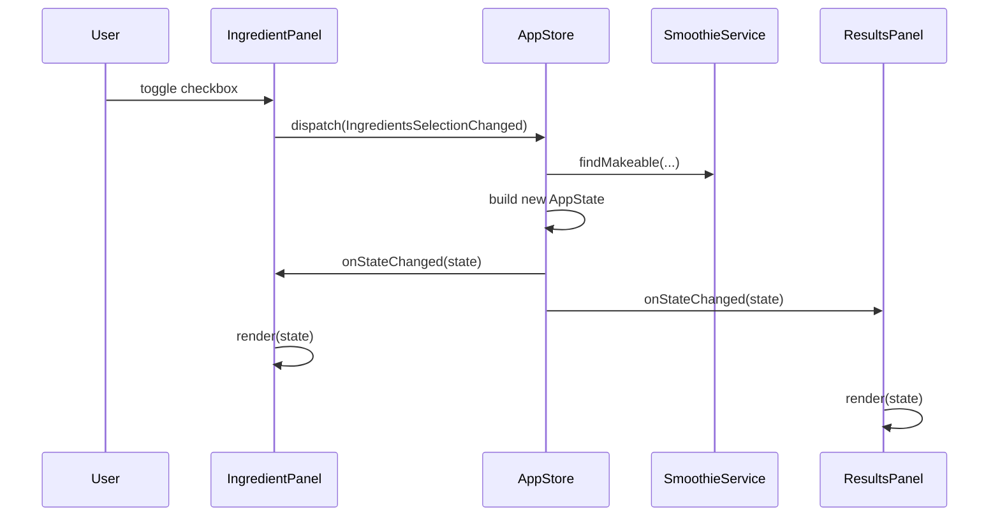

<!-- omit in toc -->
# Smoothie Maker

A desktop **Swing** application backed by **Spring Boot**. Users select ingredients they have; the app shows which smoothie recipes from a YAML catalog can be made.

This project uses a small **unidirectional, state-driven UI** pattern: UI components send **messages**, a central **store** holds **application state**, and views **render from that state** on the Swing Event Dispatch Thread (EDT).

<!-- omit in toc -->
## Table of Contents

- [Requirements](#requirements)
- [Quick start](#quick-start)
- [Architecture overview](#architecture-overview)
- [Stateful UI: `AppState`, messages, and `AppStore`](#stateful-ui-appstate-messages-and-appstore)
  - [Application state](#application-state)
  - [Messages (actions)](#messages-actions)
  - [`AppStore`](#appstore)
- [Domain layer (Spring services)](#domain-layer-spring-services)
- [Project layout](#project-layout)
- [Configuration](#configuration)
- [Why Spring Boot for a Swing app?](#why-spring-boot-for-a-swing-app)
- [Testing](#testing)
- [Design notes and tradeoffs](#design-notes-and-tradeoffs)
  - [Strengths](#strengths)
  - [Tradeoffs](#tradeoffs)
  - [Possible extensions](#possible-extensions)

## Requirements

- Java 21+
- Maven 3.9+
- [ImageMagick](https://imagemagick.org/) (`magick`) — only if you regenerate icons

## Quick start

```bash
make help    # list targets
make dev     # Spring Boot (development)
make prod    # fat JAR (production-like)
make test    # unit tests
```

**App icon:** Window and dock icons load from `src/main/resources/icons/`. Source artwork lives in `assets/logo.png`. After changing the logo, run `make icons` (see [assets/README.md](assets/README.md)).

Override the recipe file:

```bash
make dev -- --smoothies.data-file=data/smoothies.yml
```

Logs are written under `logs/` (rolling daily files). See `application.yml` and `logback-spring.xml`.

## Architecture overview

Spring Boot provides **dependency injection** and **configuration**. Swing provides the **desktop UI**. The two are connected deliberately:

| Layer | Responsibility |
| ----- | -------------- |
| **Bootstrap** (`SmoothieApp`) | Starts Spring with `headless(false)`, launches the frame on the EDT |
| **Domain** (`service`, `repository`, `model`) | Business rules and recipe data (no Swing types) |
| **UI** (`ui.*`) | State, messages, panels, frame layout |
| **Infrastructure** (`io`, `config`) | YAML loading, `application.yml` properties |

```text
┌─────────────────────────────────────────────────────────────┐
│  SmoothieApp (@SpringBootApplication)                       │
│    main() → Spring context → SmoothieFrame on EDT           │
└────────────────────────────┬────────────────────────────────┘
                             │
         ┌───────────────────┼────────────────-───┐
         ▼                   ▼                    ▼
   IngredientPanel      ResultsPanel         ActionsPanel
     (user input)        (read-only)         (log report)
         │                   ▲                    │
         │  dispatch()       │ subscribe()        │ dispatch()
         └──────────────► AppStore ◄──────────────┘
                            │
                            ▼
                    SmoothieService
                    SmoothieRepository
                            │
                            ▼
                    data/smoothies.yml
```

Swing itself is **imperative** (`setText`, `setSelected`, etc.). This app keeps that at the edges and treats the **screen as a function of state** in the middle.

## Stateful UI: `AppState`, messages, and `AppStore`

### Application state

`AppState` is an immutable snapshot of everything the UI needs to display:

- Loaded recipes and ingredient catalog
- Currently selected ingredients
- Formatted result lines for the smoothie list
- Count and “Selected: …” summary text

When state changes, the store notifies subscribers; each panel updates its widgets in `render(AppState)`.

### Messages (actions)

User interactions do **not** call other panels directly. They send **`AppMessage`** instances to `AppStore.dispatch()`:

| Message | Effect |
| ------- | ------ |
| `IngredientsSelectionChanged` | Recompute makeable smoothies from checkbox selection |
| `SelectAllIngredients` | Select every ingredient |
| `ClearAllIngredients` | Clear selection |
| `LogReportRequested` | Write a detailed report to the log (no state change) |

This is a lightweight **Flux-style** flow: **event → new state → re-render**.



### `AppStore`

- **Single source of truth** for UI state
- **`dispatch(AppMessage)`** — applies business logic via `SmoothieService`, builds the next `AppState`
- **`subscribe(StateListener)`** — panels register once; notifications run on the **EDT** (`SwingUtilities.invokeLater` when needed)
- **Testable without Swing** — see `AppStoreTest`

Panels stay dumb where possible:

- **`IngredientPanel`** — publishes selection messages; `render()` syncs checkboxes and the selected summary
- **`ResultsPanel`** — only `render(state)` (passive view)
- **`ActionsPanel`** — dispatches `LogReportRequested`
- **`SmoothieFrame`** — layout, window chrome, shutdown

## Domain layer (Spring services)

| Component | Role |
| --------- | ---- |
| `SmoothieRepository` | Loads recipes from YAML at startup |
| `SmoothieService` | `canMake`, `findMakeable`, formatting helpers |
| `YamlLoader` | Jackson YAML → Java records |
| `SmoothieProperties` | `smoothies.data-file` from `application.yml` |

Models are **Java records** (`Smoothie`, `Ingredients`, `SmoothiesWrapper`).

## Project layout

```text
src/main/java/org/example/smoothies/
├── SmoothieApp.java              # Spring Boot entry point
├── config/SmoothieProperties.java
├── io/YamlLoader.java
├── model/                        # Recipe records
├── repository/                   # Data access interface + impl
├── service/                      # Business logic interface + impl
└── ui/
    ├── AppStore.java             # State + message dispatch
    ├── SmoothieFrame.java        # Main window
    ├── StateListener.java
    ├── message/AppMessage.java
    ├── state/AppState.java
    └── component/                # Swing panels
    AppIcons.java                 # Loads /icons/*.png for the frame

src/main/resources/
    icons/                        # Generated PNGs (make icons)
├── application.yml
├── logback-spring.xml
└── data/smoothies.yml

src/test/java/                    # AppStore, service, YamlLoader tests

assets/
    logo.png, logo.svg            # Source artwork (not loaded at runtime)
    icons/                        # app.ico, app.icns for native packaging

scripts/
    generate_icons.py             # ImageMagick icon generator
```

## Configuration

`application.yml`:

```yaml
smoothies:
  data-file: data/smoothies.yml

logging:
  file:
    name: logs/smoothie-maker.log
  level:
    org.example.smoothies: DEBUG
```

## Why Spring Boot for a Swing app?

- **Constructor injection** for services, store, and panels
- **Externalized config** (`smoothies.data-file`, logging)
- **Consistent startup** (`SpringApplicationBuilder`, `headless(false)`)
- **Testability** — swap repositories or test `AppStore` in isolation

The UI does not use Spring MVC or the web stack; only the core container and logging.

## Testing

- **`AppStoreTest`** — state transitions and subscriptions (no GUI)
- **`SmoothieServiceTest`** — ingredient catalog and matching rules
- **`YamlLoaderTest`** — load errors and parsing

```bash
mvn test
```

## Design notes and tradeoffs

### Strengths

- Clear separation: domain logic vs. UI state vs. Swing widgets
- Easy to add a new message type and handle it in one place (`AppStore`)
- UI panels can be tested or replaced without touching services

### Tradeoffs

- More types and indirection than a single `JFrame` class
- Swing still requires careful **EDT** discipline (store notifies on EDT)
- Not fully declarative (no FXML/Compose); widgets are updated imperatively inside `render()`

### Possible extensions

- Startup error dialog if YAML fails to load
- Load recipes from an external file path (`file:./config/...`)
- Export report to a file instead of only logging
- Split `SmoothieFrame` / presenter further if the app grows
